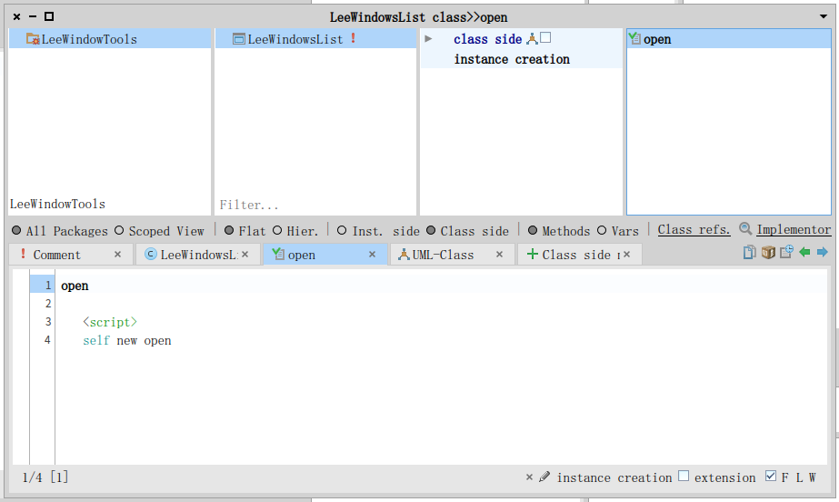

# LeeWindowTools

A simple windows list and switch tool for Pharo.

Usage: 
```
LeeWindowsList open
```

or, just simply click the open icon on LeeWindowsList's class side.



or, open in the Windows menu:


It will open a window, listing all the windows opened, then click to switch.


## Known bugs
- close some windows, the LeeWindowsList listing window won't refresh.
- the menu windows should not display.
- the initial opened window is too small.